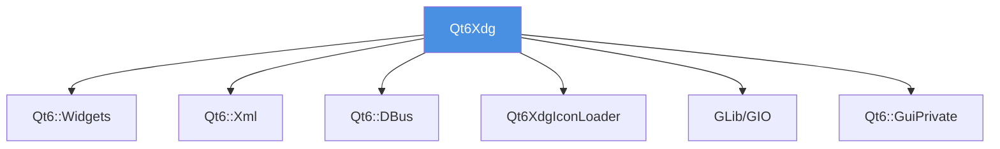

# Qt6Xdg 核心库模块

> 📍 **导航：** [项目根目录](../../CLAUDE.md) > src/qtxdg

## 模块概述

Qt6Xdg 是 libqtxdg 的核心库模块，实现了完整的 XDG（Cross-Desktop Group）标准规范，为 Qt 应用提供跨桌面环境的标准化功能。

**库名称：** Qt6Xdg
**文件名：** qt6xdg
**模块路径：** `src/qtxdg/`

## 核心职责

1. **桌面文件管理** - 解析和处理 .desktop 文件
2. **菜单系统** - 实现 XDG 菜单规范
3. **目录管理** - XDG 基础目录规范支持
4. **图标处理** - 图标查找和主题支持
5. **MIME 类型** - MIME 类型识别和默认应用关联
6. **自动启动** - 管理应用自动启动配置

## 公共 API 类

### 桌面文件相关
- **XdgDesktopFile** (`xdgdesktopfile.h`)
  - 解析 .desktop 文件
  - 获取应用名称、图标、执行命令等
  - 启动应用程序

- **XdgAction** (`xdgaction.h`)
  - 表示桌面文件中的动作（Actions）
  - 支持右键菜单等场景

### 菜单系统
- **XdgMenu** (`xdgmenu.h`)
  - 实现 XDG 菜单规范
  - 构建应用程序菜单树
  - 支持菜单过滤和排序

- **XdgMenuWidget** (`xdgmenuwidget.h`)
  - 提供可视化菜单 Widget
  - 基于 XdgMenu 的 Qt Widget 封装

### 目录管理
- **XdgDirs** (`xdgdirs.h`)
  - XDG 基础目录规范实现
  - 提供配置、数据、缓存等标准目录
  - 支持 `XDG_CONFIG_HOME`、`XDG_DATA_HOME` 等环境变量

### 图标处理
- **XdgIcon** (`xdgicon.h`)
  - 图标查找和加载
  - 支持图标主题
  - 与 Qt6XdgIconLoader 集成

### MIME 类型
- **XdgMimeType** (`xdgmimetype.h`)
  - MIME 类型识别
  - 文件类型判断

- **XdgMimeApps** (`xdgmimeapps.h`)
  - MIME 类型与应用关联
  - 管理默认应用程序

- **XdgDefaultApps** (`xdgdefaultapps.h`)
  - 默认应用管理
  - 支持文件管理器、终端、浏览器等

### 自动启动
- **XdgAutoStart** (`xdgautostart.h`)
  - 管理应用自动启动
  - 读写 autostart 目录中的 .desktop 文件

### 工具类
- **XmlHelper** (`xmlhelper.h`)
  - XML 解析辅助工具

## 内部实现类（私有）

- `xdgdesktopfile_p.h` - 桌面文件私有实现
- `xdgmenu_p.h` - 菜单系统私有实现
- `xdgmimeapps_p.h` - MIME 应用私有实现
- `xdgmenuapplinkprocessor.h` - 菜单应用链接处理器
- `xdgmenulayoutprocessor.h` - 菜单布局处理器
- `xdgmenureader.h` - 菜单文件读取器
- `xdgmenurules.h` - 菜单规则处理
- `qtxdglogging.h` - 日志系统

## 依赖关系



### 外部依赖
- **Qt6::Widgets** - UI 组件基础
- **Qt6::Xml** - XML 解析（菜单文件）
- **Qt6::DBus** - D-Bus 通信（应用启动）
- **Qt6::GuiPrivate** - Qt 私有 API
- **Qt6XdgIconLoader** - 图标加载器
- **GLib/GIO** - MIME 类型后端实现

## 关键文件

### 源文件（.cpp）
```
qtxdglogging.cpp          # 日志系统
xdgaction.cpp             # 桌面动作
xdgdesktopfile.cpp        # 桌面文件
xdgdirs.cpp               # 目录管理
xdgicon.cpp               # 图标处理
xdgmenu.cpp               # 菜单系统
xdgmenuapplinkprocessor.cpp
xdgmenulayoutprocessor.cpp
xdgmenureader.cpp
xdgmenurules.cpp
xdgmenuwidget.cpp         # 菜单 Widget
xmlhelper.cpp             # XML 工具
xdgautostart.cpp          # 自动启动
xdgmimetype.cpp           # MIME 类型
xdgmimeapps.cpp           # MIME 应用
xdgmimeappsbackendinterface.cpp
xdgmimeappsglibbackend.cpp
xdgdefaultapps.cpp        # 默认应用
```

### D-Bus 接口
- `dbus/org.freedesktop.Application.xml` - FreeDesktop 应用接口

## 构建配置

### CMake 变量
- `QTXDGX_LIBRARY_NAME` = "Qt6Xdg"
- `QTXDGX_FILE_NAME` = "qt6xdg"
- `QTXDG_VERSION_STRING` = "4.2.0"

### 编译定义
- `QTXDG_COMPILATION="1"` - 标记库编译
- `QTXDG_VERSION="${QTXDG_VERSION_STRING}"` - 版本信息
- `QT_NO_KEYWORDS` - 避免 Qt 宏冲突

### 安装路径
- **库文件：** `${CMAKE_INSTALL_LIBDIR}/libQt6Xdg.so`
- **头文件：** `${CMAKE_INSTALL_INCLUDEDIR}/qt6xdg/`
- **便携头文件：** 自动生成（如 `XdgDesktopFile` -> `xdgdesktopfile.h`）

## 使用示例

### C++ 代码示例

```cpp
#include <XdgDesktopFile>
#include <XdgDirs>
#include <XdgIcon>

// 1. 使用 XDG 目录
QString configDir = XdgDirs::configHome();
QString dataDir = XdgDirs::dataHome();

// 2. 加载桌面文件
XdgDesktopFile desktop;
if (desktop.load("/usr/share/applications/firefox.desktop")) {
    QString name = desktop.name();
    QIcon icon = desktop.icon();
    desktop.startDetached();  // 启动应用
}

// 3. 图标查找
QIcon icon = XdgIcon::fromTheme("document-open");

// 4. 默认应用
QString browser = XdgDefaultApps::webBrowser();
QString terminal = XdgDefaultApps::terminal();
```

## 测试

测试文件位于 `../../test/` 目录，使用 Qt Test 框架。

启用测试：
```bash
cmake .. -DBUILD_TESTS=ON
make
ctest
```

## 开发注意事项

1. **线程安全**：大部分类不是线程安全的，需要在主线程使用
2. **GLib 后端**：MIME 类型处理依赖 GLib，确保系统已安装
3. **环境变量**：支持标准 XDG 环境变量覆盖默认路径
4. **便携头文件**：使用 `lxqt_create_portable_headers` 自动生成
5. **私有 API**：避免直接使用 `_p.h` 私有头文件

## 相关模块

- [Qt6XdgIconLoader](../xdgiconloader/CLAUDE.md) - 图标加载器
- [Qt6XdgQml](../qtxdgqml/CLAUDE.md) - QML 插件
- [示例程序](../../examples/CLAUDE.md) - 使用示例

## 参考资源

- **XDG 基础目录规范：** https://specifications.freedesktop.org/basedir-spec/
- **XDG 桌面入口规范：** https://specifications.freedesktop.org/desktop-entry-spec/
- **XDG 菜单规范：** https://specifications.freedesktop.org/menu-spec/
- **MIME 应用规范：** https://specifications.freedesktop.org/mime-apps-spec/
