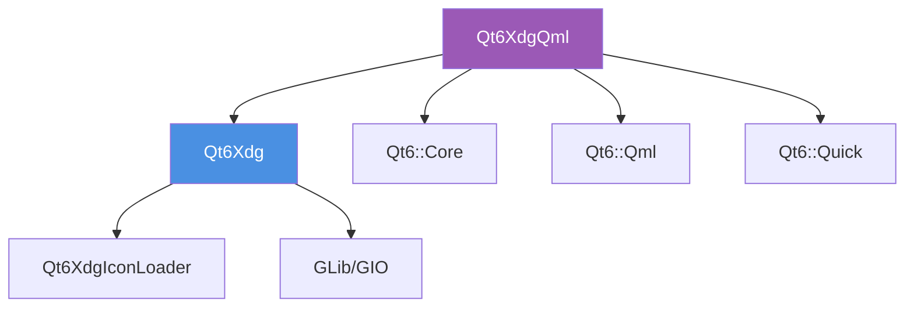

# Qt6XdgQml QML 插件模块

> 📍 **导航：** [项目根目录](../../CLAUDE.md) > src/qtxdgqml

## 模块概述

Qt6XdgQml 为 QML 应用提供 XDG 功能的封装，使 QML 应用能够直接使用 libqtxdg 的所有核心功能，包括目录管理、图标处理、桌面文件操作等。

**库名称：** Qt6XdgQml
**文件名：** qt6xdgqml
**QML URI：** org.lxqt.qtxdg
**模块路径：** `src/qtxdgqml/`

## 核心职责

1. **QML API 封装** - 将 C++ XDG 功能暴露给 QML
2. **属性绑定** - 提供响应式的 XDG 数据访问
3. **异步操作** - 支持 QML 中的异步文件操作
4. **类型安全** - 类型安全的 QML 扩展

## QML 模块结构

```
QML 模块: org.lxqt.qtxdg (v6.0)
输出目录: build/qml/org/lxqt/qtxdg/
安装目录: ${QT_INSTALL_LIBS}/qt6/qml/org/lxqt/qtxdg/
```

## QML API 组件

### 1. XdgDirsWrapper
**QML 类型：** `XdgDirs`
**C++ 类：** `XdgDirsWrapper`

**功能：**
- 访问标准 XDG 目录
- 监听目录变化
- 提供便捷的属性接口

**QML 使用示例：**
```qml
import org.lxqt.qtxdg 6.0

ApplicationWindow {
    property var xdgDirs: XdgDirs {}

    Text {
        text: "Config: " + xdgDirs.configHome
    }

    Text {
        text: "Data: " + xdgDirs.dataHome
    }
}
```

### 2. XdgIconWrapper
**QML 类型：** `XdgIcon`
**C++ 类：** `XdgIconWrapper`

**功能：**
- 图标查找和加载
- 主题图标访问
- 图标尺寸处理

**QML 使用示例：**
```qml
import org.lxqt.qtxdg 6.0

Button {
    icon {
        name: "document-open"
        source: XdgIcon.fromTheme("document-open", "text-x-generic")
    }
}
```

### 3. XdgDesktopFileWrapper
**QML 类型：** `XdgDesktopFile`
**C++ 类：** `XdgDesktopFileWrapper`

**功能：**
- 桌面文件解析
- 应用程序信息访问
- 应用启动控制

**QML 使用示例：**
```qml
import org.lxqt.qtxdg 6.0

ApplicationWindow {
    property var desktopFile: XdgDesktopFile {
        fileName: "/usr/share/applications/firefox.desktop"
        Component.onCompleted: load()
    }

    Button {
        text: desktopFile.valid ? desktopFile.name : "无效"
        enabled: desktopFile.valid
        onClicked: desktopFile.startDetached()
    }
}
```

### 4. XdgAutoStartWrapper
**QML 类型：** `XdgAutoStart`
**C++ 类：** `XdgAutoStartWrapper`

**功能：**
- 自动启动应用管理
- 桌面文件扫描
- 启用/禁用自动启动

### 5. XdgDefaultAppsWrapper
**QML 类型：** `XdgDefaultApps`
**C++ 类：** `XdgDefaultAppsWrapper`

**功能：**
- 默认应用程序查询
- 系统设置访问
- 文件类型关联

## C++ Wrapper 类

### 源文件结构
```
qtxdgqml/
├── qtxdgqmlplugin.cpp/h      # QML 插件主文件
├── xdgdirswrapper.cpp/h      # XdgDirs QML 包装器
├── xdgiconwrapper.cpp/h      # XdgIcon QML 包装器
├── xdgdesktopfilewrapper.cpp/h  # DesktopFile QML 包装器
├── xdgautostartwrapper.cpp/h # AutoStart QML 包装器
└── xdgdefaultappswrapper.cpp/h  # DefaultApps QML 包装器
```

### 核心特性

#### 1. 属性绑定
```cpp
// XdgDirsWrapper 示例
class XdgDirsWrapper : public QObject {
    Q_PROPERTY(QString configHome READ configHome NOTIFY configHomeChanged)
    Q_PROPERTY(QString dataHome READ dataHome NOTIFY dataHomeChanged)
    Q_PROPERTY(QString cacheHome READ cacheHome NOTIFY cacheHomeChanged)
    // ...
};
```

#### 2. 自动类型转换
c++ 对象到 QML 类型的自动转换，包括：
- `QIcon` → `QJSValue` (图标信息)
- `QStringList` → `QJSValue` (数组)
- 枚举类型集中管理

#### 3. 错误处理
- 无效操作返回默认值
- 异步操作的错误回调
- QML 控制台错误输出

## 依赖关系



### 外部依赖
- **Qt6::Core** - 基础功能
- **Qt6::Qml** - QML 引擎
- **Qt6::Quick** - Quick 组件
- **Qt6Xdg** - 核心 XDG 功能

## 构建配置

### CMake 配置
```cmake
set(QTXDGQML_LIBRARY_NAME "Qt6XdgQml")
set(QML_MODULE_URI "org.lxqt.qtxdg")
set(QML_MODULE_VERSION 6.0)

# 使用 qt_add_qml_module 自动生成
target_link_libraries(${QTXDGQML_LIBRARY_NAME}
    PUBLIC
        Qt6::Core
        Qt6::Qml
        Qt6::Quick
        ${QTXDGX_LIBRARY_NAME}
)
```

### 输出文件
- `qmldir` - QML 模块描述文件
- `plugins.qmltypes` - 类型信息（自动生成）
- `libQt6XdgQml.so` - QML 插件库

### 安装路径
- **QML 模块：** `${CMAKE_INSTALL_LIBDIR}/qt6/qml/org/lxqt/qtxdg/`
- **库文件：** `${CMAKE_INSTALL_LIBDIR}/`

## QML 集成

### 导入模块
```qml
import org.lxqt.qtxdg 6.0
```

### 常用模式

#### 1. 文件管理器文件列
```qml
ListView {
    model: fileModel
    delegate: Item {
        Row {
            Image {
                source: XdgIcon.fromTheme(fileIconName, "application-octet-stream")
            }
            Text {
                text: fileName
            }
        }
    }
}
```

#### 2. 应用启动器
```qml
GridView {
    model: desktopFilesModel
    delegate: Button {
        icon.source: XdgIcon.fromTheme(model.icon, "application-x-executable")
        text: model.name
        onClicked: {
            var desktop = XdgDesktopFile {}
            desktop.fileName = model.fileName
            desktop.load()
            if (desktop.valid) {
                desktop.startDetached()
            }
        }
    }
}
```

## 完整 QML 示例

```qml
import QtQuick
import QtQuick.Controls
import org.lxqt.qtxdg 6.0

ApplicationWindow {
    width: 400
    height: 300
    title: "QML XDG Demo"

    // 属性
    property var xdgDirs: XdgDirs {}
    property var defaultApps: XdgDefaultApps {}
    property var firefox: XdgDesktopFile {
        fileName: "/usr/share/applications/firefox.desktop"
        Component.onCompleted: load()
    }

    Column {
        anchors.centerIn: parent
        spacing: 10

        Label {
            text: "Home Directory: " + xdgDirs.configHome
        }

        Label {
            text: "Default Browser: " + defaultApps.webBrowser
        }

        Button {
            text: firefox.valid ? firefox.name : "Firefox 未安装"
            enabled: firefox.valid
            onClicked: {
                firefox.startDetached()
                console.log("启动 Firefox")
            }
        }

        Row {
            spacing: 10

            Button {
                icon.source: XdgIcon.fromTheme("document-open")
                text: "打开文档"
            }

            Button {
                icon.source: XdgIcon.fromTheme("folder")
                text: "打开文件夹"
            }
        }
    }
}
```

## 性能优化

1. **延迟加载**
```qml
// 延迟加载桌面文件
property var desktopFile: null

Button {
    onClicked: {
        if (!desktopFile) {
            desktopFile = Qt.createQmlObject(
                'import org.lxqt.qtxdg 6.0; XdgDesktopFile {}',
                parent, 'dynamicDesktop'
            )
        }
        desktopFile.fileName = ...
    }
}
```

2. **缓存机制**
- QML 引擎自动缓存创建的对象
- 重复使用相同的 wrapper 实例

3. **异步操作**
- 文件加载在后台线程进行
- 使用 QML 信号通知完成

## 开发注意事项

1. **QQmlEngine 初始化**：确保 QML 引擎正确设置导入路径
2. **线程安全**：QML 操作在主线程，避免从后台线程调用 wrapper
3. **内存管理**：使用 QML 的对象所有权模型，避免手动 delete
4. **错误处理**：在 QML 中添加适当的错误检查
5. **版本兼容**：QML 模块版本与库版本需要匹配

## 测试 QML 功能

### 测试环境设置
```bash
# 构建安装后，设置 QML 路径
export QML2_IMPORT_PATH=/usr/local/lib/qt6/qml:$QML2_IMPORT_PATH

# 使用 qmlscene 测试
qmlscene my_test.qml
```

### 调试技巧
```qml
// 在 QML 中调试
Component.onCompleted: {
    console.log("XdgDirs available:", XdgDirs)
    console.log("Config home:", xdgDirs.configHome)
}
```

## 相关模块

- [Qt6Xdg 核心库](../qtxdg/CLAUDE.md) - 底层 C++ 实现
- [示例程序](../../examples/qml-example/CLAUDE.md) - QML 使用示例

## 参考资源

- **Qt QML 模块：** https://doc.qt.io/qt-6/qtqml-index.html
- **QML 插件开发：** https://doc.qt.io/qt-6/qtqml-modules-qmlplugins.html
- **Qt Quick Controls：** https://doc.qt.io/qt-6/qtquick-controls-index.html
