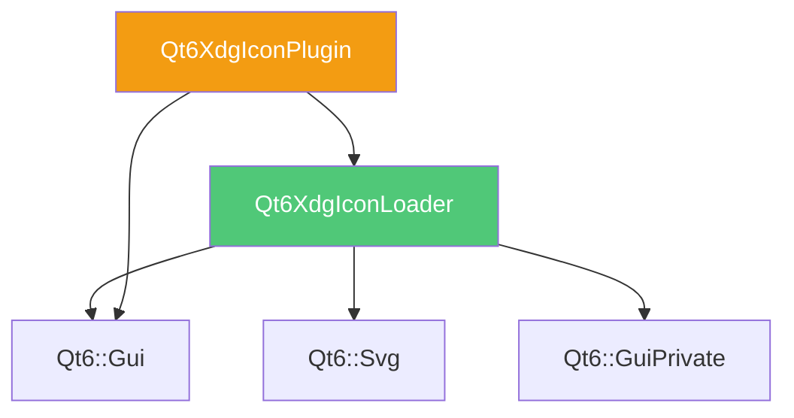

# Qt6XdgIconLoader 图标加载器模块

> 📍 **导航：** [项目根目录](../../CLAUDE.md) > src/xdgiconloader

## 模块概述

Qt6XdgIconLoader 是专门负责 XDG 图标主题加载的独立库模块，提供高性能的图标查找和缓存机制，支持 GTK+ 图标缓存格式以加速图标查找。

**库名称：** Qt6XdgIconLoader
**文件名：** qt6xdgiconloader
**模块路径：** `src/xdgiconloader/`

## 核心职责

1. **图标主题加载** - 按照 XDG 图标主题规范查找图标
2. **缓存支持** - 支持 GTK+ 图标缓存（icon-theme.cache）
3. **图标引擎插件** - 提供 Qt 图标引擎插件
4. **多尺寸支持** - 自动选择最合适的图标尺寸
5. **主题继承** - 支持图标主题继承链

## 模块结构

```
xdgiconloader/
├── CMakeLists.txt              # 构建配置
├── xdgiconloader.cpp           # 图标加载器实现
├── xdgiconloader_p.h           # 私有头文件（可安装）
└── plugin/                     # Qt 图标引擎插件
    ├── CMakeLists.txt
    ├── xdgiconengineplugin.cpp
    └── xdgiconengineplugin.h
```

## 核心组件

### 1. XdgIconLoader（私有实现）
**文件：** `xdgiconloader_p.h`, `xdgiconloader.cpp`

**功能：**
- 实现 XDG 图标主题规范
- 图标路径查找算法
- GTK+ 缓存文件解析
- 图标尺寸匹配

**特点：**
- 私有 API（`_p.h`），但可安装供高级用户使用
- 高性能缓存机制
- 支持 SVG 和位图图标

### 2. Qt 图标引擎插件
**路径：** `plugin/`
**插件名：** Qt6XdgIconPlugin

**功能：**
- 集成到 Qt 图标系统
- 提供 `QIconEngine` 实现
- 自动注册到 Qt 插件系统

## 依赖关系



### 外部依赖
- **Qt6::Gui** - 图标和图像处理
- **Qt6::Svg** - SVG 图标支持
- **Qt6::GuiPrivate** - Qt 私有 API

## 构建配置

### CMake 变量
- `QTXDGX_ICONLOADER_LIBRARY_NAME` = "Qt6XdgIconLoader"
- `QTXDGX_ICONLOADER_FILE_NAME` = "qt6xdgiconloader"
- `QTXDGX_ICONENGINEPLUGIN_LIBRARY_NAME` = "Qt6XdgIconPlugin"

### 编译定义
- `QT_NO_KEYWORDS` - 避免 Qt 宏冲突

### 导出头文件
自动生成 `xdgiconloader_export.h`，包含库导出宏。

### 安装路径
- **库文件：** `${CMAKE_INSTALL_LIBDIR}/libQt6XdgIconLoader.so`
- **私有头文件：** `${CMAKE_INSTALL_INCLUDEDIR}/qt6xdgiconloader/${VERSION}/private/xdgiconloader/`
- **导出头文件：** `${CMAKE_INSTALL_INCLUDEDIR}/qt6xdgiconloader/xdgiconloader_export.h`
- **插件：** Qt 插件目录

## 图标查找机制

### 查找路径优先级
1. `$XDG_DATA_HOME/icons/` (默认 `~/.local/share/icons/`)
2. `$XDG_DATA_DIRS/icons/` (默认 `/usr/local/share/icons/:/usr/share/icons/`)
3. `/usr/share/pixmaps/`

### 查找算法
1. 在当前主题中查找指定尺寸
2. 查找最接近的尺寸
3. 查找可缩放图标（SVG）
4. 递归查找父主题（继承链）
5. 回退到 hicolor 主题

### GTK+ 缓存加速
- 读取 `icon-theme.cache` 文件
- 快速定位图标位置
- 缓存失效时回退到目录扫描

## 使用方式

### 通过 Qt6Xdg 使用（推荐）
```cpp
#include <XdgIcon>

// 自动使用 Qt6XdgIconLoader
QIcon icon = XdgIcon::fromTheme("document-open");
QIcon fallback = XdgIcon::fromTheme("document-open", "text-x-generic");
```

### 直接使用（高级）
```cpp
#include <xdgiconloader_p.h>

// 注意：这是私有 API，不保证 ABI 稳定性
// 仅在特殊场景使用
```

### 插件自动加载
Qt 应用启动时会自动加载 Qt6XdgIconPlugin，无需手动配置。

## 性能优化

1. **缓存机制**
   - 使用 GTK+ 缓存文件避免目录扫描
   - 内存缓存已查找的图标路径

2. **延迟加载**
   - 按需加载图标数据
   - 支持异步加载（通过 Qt 图标系统）

3. **尺寸匹配**
   - 智能选择最接近的尺寸
   - 优先使用 SVG 可缩放图标

## 图标主题支持

### 主题配置文件
每个图标主题包含 `index.theme` 文件：
```ini
[Icon Theme]
Name=Breeze
Comment=Breeze icon theme
Inherits=hicolor
Directories=actions/16,actions/22,...

[actions/16]
Size=16
Type=Fixed
```

### 主题继承
- 支持多级继承
- 最终回退到 `hicolor` 主题
- 避免循环继承

## 开发注意事项

1. **私有 API**：`xdgiconloader_p.h` 是私有实现，API 可能变化
2. **线程安全**：图标加载器内部有缓存，注意多线程访问
3. **缓存更新**：图标主题更新后需要重新生成缓存
4. **SVG 依赖**：确保 Qt6::Svg 模块可用以支持 SVG 图标
5. **插件加载**：插件路径需要在 Qt 插件搜索路径中

## 生成图标缓存

使用 GTK+ 工具生成缓存：
```bash
# 为图标主题生成缓存
gtk-update-icon-cache /usr/share/icons/breeze/

# 强制更新
gtk-update-icon-cache -f /usr/share/icons/breeze/
```

## 测试

### 测试图标加载
```cpp
#include <QIcon>
#include <QDebug>

QIcon icon = QIcon::fromTheme("document-open");
if (!icon.isNull()) {
    qDebug() << "Icon loaded successfully";
    qDebug() << "Available sizes:" << icon.availableSizes();
}
```

### 检查插件加载
```cpp
#include <QPluginLoader>
#include <QDebug>

QStringList paths = QCoreApplication::libraryPaths();
qDebug() << "Plugin paths:" << paths;
```

## 相关模块

- [Qt6Xdg 核心库](../qtxdg/CLAUDE.md) - 使用图标加载器
- [Qt6XdgQml](../qtxdgqml/CLAUDE.md) - QML 图标支持

## 参考资源

- **XDG 图标主题规范：** https://specifications.freedesktop.org/icon-theme-spec/
- **GTK+ 图标缓存：** https://docs.gtk.org/gtk3/class.IconTheme.html
- **Qt 图标系统：** https://doc.qt.io/qt-6/qicon.html
